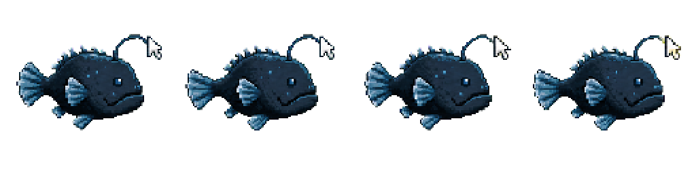

# 生き物スプライト案

`concept1.png` と `concept3.png` の静かな水中世界、低彩度の配色、輪郭の読みやすいドット絵を基準にした生き物素材。
現在は37種をアプリ本体へ接続している。潮だまり・浅瀬・珊瑚の森は、通常種とレア種を含む全36種を4コマの透過スプライトへ置き換え済み。

- ミナミハコフグ案 → 既存の `shallow-puffer`（ミナミハコフグ）
- キーアンコウ案 → 既存の `deep-lantern`（カーソルアンコウ・レア）
- しましまベラ案 → 既存の `shellfish`（キュウセン）
- すなひかりエイ案 → 既存の `sand-ray`（アカエイ）
- サンゴチョウチョウウオ案 → 既存の `coral-butterfly`（チョウチョウウオ）

命名方針: 各海域は「通常10種＋レア2種＝12種」で構成し、通常魚は実在の一般名、レア魚だけがタイピング由来の架空名を持つ（例: `deep-lantern` = カーソルアンコウ）。スプライトのファイル名（`key-angler-strip.png` など）は図鑑の表示名と独立している。カーソルアンコウは生態に合わせて深海へ配置する。

## 共通仕様

- 透過 PNG
- Retina 向け 2 倍以上の解像度
- 1 セル `256 × 256px`（最大 `124 × 124 CSS px` 表示で約 2 倍密度）
- 4 コマ横並び、全体 `1024 × 256px`
- 全コマ右向き
- CSS の上下移動と、画像内のひれ・尾・発光の動きを分離する
- `prefers-reduced-motion` またはアプリ設定で、第 1 コマの静止画にできる構成

## 1. ミナミハコフグ


- ファイル: `minami-hakofugu-strip.png`
- 枠: 通常
- 配置候補: 珊瑚の森
- モチーフ: 実在するミナミハコフグの幼魚
- 動き: ゆっくり泳ぐ。最後のコマで小さな泡を 2 つ吐く
- 推奨速度: 1 周 `0.8〜1.2s`
- 図鑑文案: 「こどものころは、きいろい体に くろい水玉もよう。小さなひれで、ふわふわ泳ぐよ。」

黄色い水玉模様は幼魚に特徴的なため、図鑑では「こどもの姿」と明記する。

## 2. キーアンコウ



- ファイル: `key-angler-strip.png`
- 枠: レア
- 配置候補: 将来の深海
- モチーフ: 実在のアンコウを基礎に、提灯だけを無刻印のキーキャップ形にした創作種
- 動き: ゆっくり泳ぎ、3〜4 コマ目で提灯が控えめに明るくなる
- 推奨速度: 1 周 `1.2〜1.6s`
- 図鑑文案: 「キーの形の あかりを ゆらして、ことばの深海を ゆっくり泳ぐ。ふしぎなアンコウ。」

レア出現はタイピング速度や正確さ、連続ログインには結びつけない。
一定回数のプレイ内で必ず会える巡回方式にすると、この作品の穏やかな収集方針と合う。
実画面へ組み込む前に、濃紺背景でも 32px 表示を識別しやすいよう、本体の外周を一段明るい青灰へ調整する。

## 3. しましまベラ


- ファイル: `striped-wrasse-strip.png`
- 枠: 通常
- 配置: 潮だまり
- 動き: 尾びれを左右に振り、最後のコマで小さな泡を吐く
- 推奨速度: 1 周 `0.9〜1.2s`

橙色の体と青緑の横縞で、既存の丸い魚影と見分けやすい細長い姿にした。

## 4. すなひかりエイ


- ファイル: `sand-ray-strip.png`
- 枠: 通常
- 配置: 浅瀬
- 動き: 左右のひれを上下させ、最後のコマで小さな泡を吐く
- 推奨速度: 1 周 `1.0〜1.4s`

砂色の縁と淡い斑点を持つ、上から少し見下ろした菱形のシルエット。

## 5. サンゴチョウチョウウオ


- ファイル: `coral-butterfly-strip.png`
- 枠: 通常
- 配置: 珊瑚の森
- 動き: 尾びれを左右に振り、最後のコマで小さな泡を吐く
- 推奨速度: 1 周 `0.9〜1.2s`

クリーム色と珊瑚色、目を通る濃い帯を使い、珊瑚の森で読める明るい配色にした。

## 実装時のデータ案

```js
{
  rarity: "common",
  sprite: {
    file: "minami-hakofugu-strip.png",
    frames: 4,
    frameMs: 250,
    sourceFacing: "right"
  }
}
```

- `FISH_SPECIES` 側だけに `rarity` と `sprite` を追加し、捕獲個体やセーブには画像 URL、向き、現在コマを保存しない。
- スプライト未設定の魚は、現在の CSS 図形へフォールバックさせる。
- 位置決め、上下の遊泳、コマ送り、左右反転を別の要素に分ける。`transform` の競合を避けられる。
- `background-size: 400% 100%` で表示し、4 コマの `background-position-x` を切り替える。
- `image-rendering: pixelated` を指定する。
- 第 1 コマを静止画として使い、アプリ設定と `prefers-reduced-motion` の両方でアニメーションを停止する。

## 潮だまりの通常種

| 種ID | 表示名 | ファイル | 動き | 1コマ |
|---|---|---|---|---:|
| `tide-goby` | マハゼ | `mahaze-strip.png` | 尾と胸びれ、最後に泡 | 300ms |
| `tide-shrimp` | イソスジエビ | `iso-suji-shrimp-strip.png` | 触角と脚、最後に泡 | 300ms |
| `left-damselfish` | ソラスズメダイ | `neon-damselfish-strip.png` | 尾と胸びれ、最後に泡 | 260ms |
| `shellfish` | キュウセン | `striped-wrasse-strip.png` | 尾びれ、最後に泡 | 270ms |
| `coral-fish` | オヤビッチャ | `oyabiccha-strip.png` | 尾と胸びれ、最後に泡 | 280ms |
| `sea-glassfish` | キビナゴ | `kibinago-strip.png` | 尾びれ、最後に泡 | 240ms |
| `grass-seahorse` | タツノオトシゴ | `crowned-seahorse-strip.png` | 背びれと巻いた尾、最後に泡 | 340ms |
| `moon-squid` | コウイカ | `golden-cuttlefish-strip.png` | 外套膜のひれと腕、最後に泡 | 320ms |
| `deep-jelly` | ミズクラゲ | `moon-jelly-strip.png` | 傘の収縮、最後に泡 | 360ms |
| `tide-hermit` | ヤドカリ | `hermit-crab-strip.png` | はさみ・脚・触角、最後に泡 | 320ms |

- 通常10種はすべて実在名で、既存の魚種ID、ステージ、遊泳層、群れ、倍率を維持する。
- レア2種は `tide-keycap-barnacle` が `keycap-barnacle-strip.png`、`tide-mantis` が `delete-mantis-strip.png` を使う。
- 生成原画は既存のキュウセン、カクレクマノミ、アカエイを画風と配置の参照にし、単色の青またはマゼンタ背景から直接 `1024 × 256px` のRGBAへ整形した。
- 実在種の識別点は、マハゼの2枚の背びれ、イソスジエビの縞と長い触角、ソラスズメダイの青黄、オヤビッチャの5本の暗色帯、キビナゴの銀青線、タツノオトシゴの冠状突起、コウイカの幅広い外套膜、ミズクラゲの4つの馬蹄形模様、ヤドカリの巻貝を優先した。

## 浅瀬の通常種

| 種ID | 表示名 | ファイル | 動き | 1コマ |
|---|---|---|---|---:|
| `shallow-puffer` | ミナミハコフグ | `minami-hakofugu-strip.png` | ひれと尾、最後に泡 | 250ms |
| `clownfish` | カクレクマノミ | `clownfish-strip.png` | 尾と胸びれ、最後に泡 | 280ms |
| `sand-ray` | アカエイ | `sand-ray-strip.png` | 左右のひれ、最後に泡 | 300ms |
| `ribbon-eel` | ハナヒゲウツボ | `ribbon-eel-strip.png` | 細長い体の波打ち、最後に泡 | 300ms |
| `bubble-jelly` | タコクラゲ | `spotted-jelly-strip.png` | 傘の収縮、最後に泡 | 360ms |
| `shell-octopus` | マダコ | `madako-strip.png` | 腕の曲げ伸ばし、最後に泡 | 320ms |
| `sun-threadfish` | イトヒキアジ | `threadfin-jack-strip.png` | 長いひれと尾、最後に泡 | 300ms |
| `shallow-garden-eel` | チンアナゴ | `spotted-garden-eel-strip.png` | 砂から出た体の首振り、最後に泡 | 360ms |
| `shallow-flounder` | ヒラメ | `olive-flounder-strip.png` | 尾びれ、最後に泡 | 320ms |
| `shallow-sardine` | マイワシ | `japanese-sardine-strip.png` | 尾びれ、最後に泡 | 240ms |

- 通常10種はすべて実在名で、既存の魚種ID、ステージ、遊泳層、群れ、倍率を維持する。
- レア2種の `shallow-tenkey-crab` と `shallow-space-puffer` も4コマ素材へ置き換え済み。
- 新規7種の高解像度原画は `tmp/imagegen/shallows/` に残し、単色の青またはマゼンタ背景から直接 `1024 × 256px` のRGBAへ整形した。
- 実在種の識別点は、ハナヒゲウツボの青い細長い体と黄色い背びれ・鼻先、タコクラゲの白斑、マダコの8本の腕、イトヒキアジの菱形の体と長いひれ、チンアナゴの黒斑、ヒラメの片側に並ぶ目、マイワシの銀青色の体側を優先した。
- チンアナゴの3コマ目は、砂から出たまま左右をきょろきょろ見回す演出として意図的に反対側を向かせている。検証時の横重心差はこの首振りによるものとして許容する。

## 珊瑚の森（通常種・レア種）

| 種ID | 表示名 | ファイル | 動き | 1コマ |
|---|---|---|---|---:|
| `coral-butterfly` | チョウチョウウオ | `coral-butterfly-strip.png` | 尾びれ、最後に泡 | 280ms |
| `coral-cardinal` | ネンブツダイ | `coral-cardinal-strip.png` | 尾とひれ、最後に泡 | 260ms |
| `coral-parrotfish` | アオブダイ | `coral-parrotfish-strip.png` | 尾と胸びれ、最後に泡 | 300ms |
| `coral-anthias` | キンギョハナダイ | `coral-anthias-strip.png` | 尾とひれ、最後に泡 | 260ms |
| `coral-tang` | ナンヨウハギ | `coral-tang-strip.png` | 尾と胸びれ、最後に泡 | 280ms |
| `coral-bannerfish` | ハタタテダイ | `coral-bannerfish-strip.png` | 長い背びれと尾、最後に泡 | 300ms |
| `coral-trigger` | モンガラカワハギ | `coral-trigger-strip.png` | 尾とひれ、最後に泡 | 320ms |
| `coral-starfish` | アオヒトデ | `coral-starfish-strip.png` | 腕をゆっくり曲げ、最後に泡 | 380ms |
| `coral-lionfish` | ハナミノカサゴ | `coral-lionfish-strip.png` | 胸びれと背びれ、最後に泡 | 340ms |
| `coral-mandarinfish` | ニシキテグリ | `coral-mandarinfish-strip.png` | 胸びれと尾、最後に泡 | 300ms |
| `coral-cleaner-shrimp` | エンターエビ | `enter-shrimp-strip.png` | JIS Enterキーを引いて押す | 320ms |
| `coral-key-slug` | タイプウミウシ | `type-slug-strip.png` | A・S・Dキーを順に傾ける | 360ms |

- ガイド役のウミガメを釣る矛盾を避けるため、`coral-turtle`（アオウミガメ）は `coral-mandarinfish`（ニシキテグリ）へ置き換えた。リリース前のため旧IDの互換処理は持たない。
- ニシキテグリは青緑の体と橙色の迷路模様、大きな胸びれを識別点にし、アオブダイと輪郭・模様が重ならないようにした。
- エンターエビのキーは、子どもにもJIS配列と分かる縦長の逆L字型にし、上面へ `ENTER` を明記した。
- タイプウミウシは背中の3つのキーキャップへ `A`・`S`・`D` を一文字ずつ記し、順に傾く動きでタイピングを表した。

## 潮だまり・浅瀬のレア種

| 状態 | 種ID | 表示名 | ファイル | 意匠 | 1コマ |
|---|---|---|---|---|---:|
| 接続済み | `tide-mantis` | デリートシャコ | `delete-mantis-strip.png` | 捕脚と一体化した、`DEL` 刻印入りのキーキャップ | 280ms |
| 接続済み | `tide-keycap-barnacle` | キャップフジツボ | `keycap-barnacle-strip.png` | 殻のふたが厚い無刻印キーキャップ | 320ms |
| 接続済み | `shallow-tenkey-crab` | テンキーガニ | `tenkey-crab-strip.png` | 甲羅の3×3節と金色の中央突起 | 300ms |
| 接続済み | `shallow-space-puffer` | スペースフグ | `space-puffer-strip.png` | 青銀色の体、長い象牙色の腹帯、膨らむ動き | 320ms |

- 4種とも実在生物の輪郭を基礎にした創作名の `real-inspired` として扱い、実在比率の分子へは加えない。
- デリートシャコは宝石色のシャコを基礎に、キースイッチ内部ではなく、子どもが判別しやすい大きな `DEL` キーを捕脚へ組み込んだ。
- キャップフジツボは単体の円錐殻にし、ふたの上面を四角く、側面を台形にすぼめてキーキャップと分かる形にした。閉じる、開き始める、蔓脚を伸ばす、泡を出して閉じる、の4コマ。
- テンキーガニは数字やUIを描かず、甲羅の9枚の節と中央の触知突起だけでテンキーを表す。検証時の横重心差は脚の交互歩行によるものとして許容する。
- スペースフグは黄色いミナミハコフグと区別するため、青銀色、丸い輪郭、長い腹帯、膨らむ動きの4点を変えた。
- キャップフジツボには新規ID `tide-keycap-barnacle` を付け、カーソルアンコウは `deep-lantern` のまま深海へ移した。深海はカーソルアンコウとタブクラゲをレア種とし、シフトダコはリリース前のロスター整理として削除した。

## 現行ロスターとの関係

- `src/domain/fish.js` には `shallow-puffer`（ぷくぷくフグ）がある。試験導入ではミナミハコフグ案をその見た目として使えるが、図鑑名を実在種へ変える場合は問題内容と海域を再確認する。
- `deep-lantern`（カーソルアンコウ）は、生態に合わせて深海のレア種として接続している。
- 潮だまりの空いたレア枠には `tide-keycap-barnacle`（キャップフジツボ）を新規IDで追加し、既存IDを別種へ流用していない。

## 生成方法とプロンプト

組み込みの画像生成を使用。`concept1.png` と `concept3.png` は画風・密度の参照画像とし、UI は生成対象に含めなかった。

- ミナミハコフグ: 「実在する幼魚、右向き、泳ぎ 3 コマ＋泡 1 コマ、低彩度の黄・濃紺・砂色、64px で読める硬いドット、4 等分の横一列、同じ基準線」
- キーアンコウ: 「実在のアンコウを基礎に、無刻印のキーキャップ形の提灯だけを創作要素にする。右向き、泳ぎ 2 コマ＋弱い発光 2 コマ、低彩度の青灰と黄土、4 等分の横一列、同じ基準線」
- しましまベラ: 「右向き、橙色の細長い体、青緑の横縞、尾びれの動き 3 コマ＋泡 1 コマ、4 等分の横一列」
- すなひかりエイ: 「右向き、砂色と海緑の菱形、ひれの上下 3 コマ＋泡 1 コマ、4 等分の横一列」
- サンゴチョウチョウウオ: 「右向き、クリーム色と珊瑚色、濃い目帯、尾びれの動き 3 コマ＋泡 1 コマ、4 等分の横一列」
- 浅瀬7種: 「各実在種の識別点を保ち、右向きまたは砂から上へ出る姿、泳ぎや首振り3コマ＋泡1コマ、4等分の横一列、同じ大きさと基準線」
- デリートシャコ: 「宝石色のシャコ、捕脚と一体化した大きなキーキャップ、上面に正確な `DEL` の3文字、構える・引く・打つ・泡」
- キャップフジツボ: 「単体の円錐殻、厚い四角い無刻印キーキャップ状のふた、閉じる・開く・蔓脚を右へ伸ばす・泡」
- テンキーガニ: 「赤珊瑚色のカニ、甲羅に3×3の盛り上がった節、中央だけ金色、歩脚とはさみの動き・泡」
- スペースフグ: 「青銀色の丸いフグ、長い象牙色の腹帯、少し膨らむ・大きく膨らむ・泡を出して戻る」
- 共通制約: 「デリートシャコの `DEL` 以外の文字・UI・影・3D・過剰な発光を入れない。単色クロマキー背景、同じピクセルグリッド、1 セルに 1 匹」

組み込みの画像生成で作った高解像度原画から直接クロマキーを透過へ変換し、最近傍補間で `1024 × 256px` に書き出した。小さい画像を再拡大していないため、原画の大きなドットと輪郭を維持している。輪郭色とマゼンタ背景が干渉した2種は、魚体色を保護するため純青背景で再生成した。
公開素材はクロマキー色を除去して透過し、原画と同じ比率の4セルへ整形している。
